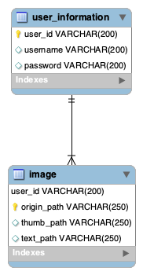

# Text-Detection-On-Photos

### User's Guide

#### To Run & Test the Application Within EC2 Instance

##### 1. Log in to EC2

We are using AWS educate account. To avoid unexpected situations, username and passward are mentioned in **credentials.txt** as well. Click  [AWS sign-in page](https://console.aws.amazon.com/) to sign in to the console, and find EC2 among all services.

<p align="center">
   
   <br />
   <b>Sign in page</b>
</p>

<p align="center">
   
   <br />
   <b>AWS Management Console</b>
</p>

##### 2. Start the instance

After logging into the EC2 dashboard, click **Running Instances** in **resources** and choose the only instance listed named **ece1779**. Choose **Actions → Instance State → Start** to start the instance.

<p align="center">
   
   <br />
   <b>Resources in EC2 Dashboard</b>
</p>

<p align="center">
   
   <br />
   <b>Start the instance</b>
</p>

##### 3. Connect to the instance using SSH

The keypair is sent along with the documentation (named **keypair_demo.pem**). To connect to the instance using SSH and a VNC Client,a detailed video tutorial is given [here](https://www.youtube.com/watch?v=kQRajb1b7iw&feature=youtu.be).

##### 4. Run the code using start.sh

You can find a shell script named **start.sh** to initialize our web application, whose directory path is

> /home/ubuntu/Desktop

Use the commend line to run **start.sh** and start the application by typing:

```
$ cd /home/ubuntu/Desktop
$ ./start.sh
```

##### 5. Test on load generator

You can find a load generator named **gen.py** to initialize our web application, whose directory path is

> /home/ubuntu

To run the generator, run the python script using:

1. ```
   python3.7 gen.py upload_url username password upload_rate(upload_per_second) image_folder number_of_uploads
   ```

For example:

1. ```
   python3.7 gen.py http://9.9.9.9:5000/api/upload user pass 1 ./my-photos/ 100
   ```


#### To Use the Web Application

Our web application is substantially an album, which allows you to register, log in and out, as will as upload photos. Our application will save your uploaded photo as will as its thumbnail and result of text-detection, which is a new photo with green rectangle around texts. When you go into your own album, you will see thumbnails of all your uploaded photos. Click on one of them to see the origin photo, thumbnail and result of text-detection.

Detailed derections are shown below with sample screenshots.

###### Visit the Webpage

Open the browser and enter the dynamic URL **Server's IPv4 address + :5000** to access the welcome page.

<p align="center">
   
   <br />
   <b>Welcome Page</b>
</p>

###### Register or Login

Click on **"Login&Register"** to either login your previous account or create a new account. Also, you can simply put mouse on **"Login&Register"** and choose from the drop-down menu.

<p align="center">
   
   <br />
   <b>Login&Register Page</b>
</p>

###### Upload Photos

After successfully logged in, you will be automatically redirected to the upload page. Follow the instructions to upload your photo once a time. Notice that the format is restricted to **.png**, **.jpg** and **.jpeg**. Also, your photo can not be bigger than **100MB**.

<p align="center">
   
   <br />
   <b>Upload Page</b>
</p>

After uploading, your photo will be saved, as well as its thumbnail and result of text-detection. After going through all these steps, it will return a message to show that you have successfully uploaded a photo. You can choose to upload more photos or click on **album** to view your previous photos in thumbnail.

<p align="center">
   
   <br />
   <b>Success Message</b>
</p>

###### Album

Your album is somewhere that contains all your uploaded photos. Instead of origin photos, the page shows thumbnails.


<center>Album</center>
Click on a thumbnail, and you will get a new page for the origin photo, thumbnail and result of text-detection, which draws green rectangles around texts.


<center>Show a Photo Transformation</center>

###### Log Out

You can log out at any time by clicking **logout**. However, neither upload nor album function can be used without logging in.


### Developer's Reference

#####General Architecture of the Project

```python
----A1_3.0\
    |----gen.py 												# load generator
    |----run.py 												# run the web application
    |----db\														# database
    |    |----create_table.sql
    |----app\ 													# main application
    |    |----static\ 									# a static path to store photos in the local system
    |    |----templates\ 								# HTML templates
    |    |    |----base.html
    |    |    |----show.html
    |    |    |----album.html
    |    |    |----register.html
    |    |    |----user.html
    |    |    |----login.html
    |    |    |----view.html
    |    |    |----welcome.html
    |    |    |----upload.html
    |    |----__init__.py
    |    |----main.py 									# the initial function
    |    |----config.py 								# database configuration
    |    |----user_op_data.py 					# functions related to database
    |    |----user_op.py 								# functions related to register & log in
    |    |----upload.py 								# functions related to photo uploading and saving
    |    |----view.py										# functions related to photo showing
    |    |----suppression.py 						# the pre-trained EAST text detector
    |    |----frozen_east_text_detection.pb	  # text detector

```


##### Important functions in python files

Corresponding to three requirements of our web application, there are three main python files in our general architecture, which includes functions related to user register&login, photo uploading and saving, and photo displaying respectively.

###### user_op.py

- login() :
  - set information for username and error message of login interface
  - return login.html template to display the login form

- login_submit() :
   - judge if username and password are in the form
   - compare user information with the information in the database
   - when login succussed, redirect to url for disphoto function
   - when login failed, redirect to url for login function with error message

- register() :
   - set information of username and error message in register interface
   - return register.html template to display the register form
   
- register_submit() :
   - judge if all information is in the form
   - judge if the username to be registered is invalid(more than 100 characters, or duplicate username)
   - judge if two passwords are different
   - save valid information into database
   - when register successed, return url for login() with success message
   - when register failed, return url for register() with error message

- logout() :
   - clear all session information
   - redirect url for main, which is the welcome page

- disPhoto() :		
   - set error message if the message exists
   - redirect url for disphoto, which is the main inferface of upload photos and display photos

###### upload.py

- **upload()** 
  - save the uploaded file in a certain path
  - generate  and save the thumbnail of original file using PIL
  - generate  and save the result of text-detction using OpenCV
  - save the paths in database
  - return `"Upload successed!"`
- **showphoto(filename) **: select a certain row in database according a certain path of thumbnail

###### view.py

+ **view()** : select path of all thumbnails corresponding to the username of the authorized user, and pass it to ```view.html```


##### Flow Chart


##### Database Schema



<center>Database Schema</center>

There are two tables:
- user_information table include three columns:
  - user_id: unique id for every user, basiclly is the num+1 when new user is registering, primary key
  - username: information for username
  - password: salted password saved in the password column

- image table inculde four columns:
  - user_id: in order to conncet to table user_information, primary key
  - origin_path: file path for original photos
  - thumb_path: file path for thumbnails
  - text_path: file path for photos after text-detction process


@ Copyright 2019, Nianchong Wu & Jingwen Zhang & Yiyun Xu. Created using Markdown

